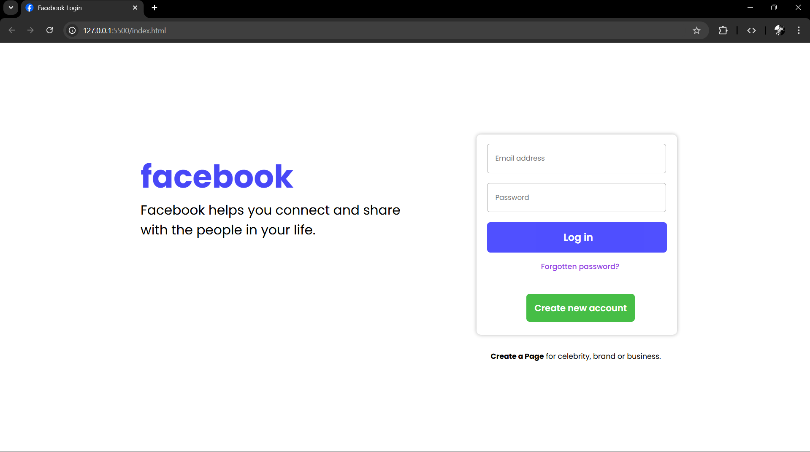

# 🌐 Facebook Login Page Clone

This project is a simple **Facebook Login Page UI Clone** built using **HTML and CSS**.  
It recreates the familiar design of Facebook’s login interface, focusing on clean structure and responsive styling.

---

## 🧩 Features

- Facebook-style login form with buttons and links  
- Clean, modern layout using **Poppins** font  
- Button hover effects for better interactivity  
- Includes favicon for a realistic look  
- Organized HTML and CSS structure  

---

## 🛠️ Technologies Used

- **HTML5** — Structure of the webpage  
- **CSS3** — Styling and layout  
- **Google Fonts (Poppins)** — Typography  

---
## 📸 Preview

